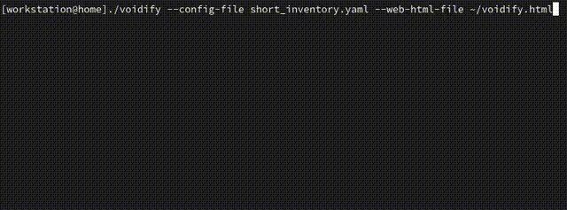
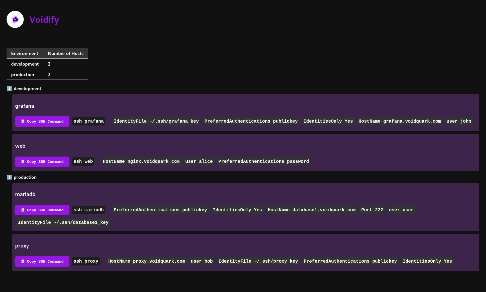

<h1 align="center"
    style="border-bottom: none;">
    <a href="//github.com/voidquark/voidify" target="_blank"></a>
    <br>&nbsp;&nbsp;&nbsp;Voidify
</h1>

**Simplify and Fastify your SSH Management**

Voidify simplifies and accelerates SSH management, eliminating the need for numerous SSH aliases or dealing with bash auto-completions. With Voidify, you don't have to worry about remembering all the server details. Instead, just run Voidify, use your arrow keys in the terminal to navigate through environment selections, and choose the server name you want to connect to. You can even start typing to filter hosts while making your selection. It takes inspiration from Ansible's YAML-based inventory to simplify configuration, which is automatically translated into SSH config.

**Key Features:**
- 📝 **YAML Power:** Utilize YAML configuration as the source of truth for your SSH connections.
- ⚡ **Instant SSH Config:** Automatically generate SSH config at runtime, faster than the speed of light.
- 🔎 **Filter Environments and Hosts:** Use the interactive menu to quickly filter and locate your target host.
- 🌐 **Web-based Visualization**: Automatically generate static HTML website to swiftly navigate your environments and hosts. Includes one-click SSH copy command.

## Showcase



Generated static HTML website.


**Supported Flags**:
```

┓┏  • ┓•┏
┃┃┏┓┓┏┫┓╋┓┏
┗┛┗┛┗┗┻┗┛┗┫
	  ┛
Voidify is your key to simplified and accelerated SSH management.
With a YAML-based host inventory inspired by Ansible inventory,
Voidify transforms it into an SSH config, making connection to your servers ultra simple.
Simply use the CLI to navigate through environment selection and host selection, and connect to your target host.

Usage:
  voidify [flags]

Flags:
  -c, --config-file string           specify the path to the YAML inventory file (required)
  -h, --help                         help for voidify
  -o, --out-ssh-config-file string   specify the path to the SSH config file (default: $HOME/.ssh/config)
  -v, --version                      version for voidify
  -w, --web-html-file string         optionally generate a static HTML website, specify the file path, including the file name, e.g., /tmp/voidify.html (Not generated by default)
```


## Inventory Config

The inventory configuration for Voidify is inspired by Ansible YAML inventory structure but simplified for ease of use. It consists of two main sections: `Environment` and `hosts`.

- `Environment`: Represents different environments, such as `production` and `development`, where your hosts are grouped.
- `hosts`: Defines individual hosts with user-friendly names (alias), like `mariadb`, which make it easy to identify where you want to connect.

Inside each `host`, you need to specify `key: value` pairs, where `key` corresponds to a supported SSH config parameter. Ensure that the `key` is written exactly as it appears in a typical SSH config file. The `value` field holds the value for that key.

> [!NOTE]
> Voidify doesn't validate if the `key` is a valid SSH option, so make sure you provide supported SSH options.

Here's an example:
```yaml
---
production:
  hosts:
    mariadb:
      HostName: "database1.voidquark.com"
      Port: 222
      user: "user"
      IdentityFile: "~/.ssh/database1_key"
      PreferredAuthentications: "publickey"
      IdentitiesOnly: "Yes"
    proxy:
      HostName: "proxy.voidquark.com"
      user: "bob"
      IdentityFile: "~/.ssh/proxy_key"
      PreferredAuthentications: "publickey"
      IdentitiesOnly: "Yes"
development:
  hosts:
    web:
      HostName: "nginx.voidquark.com"
      user: "alice"
      PreferredAuthentications: "password"
    grafana:
      HostName: "grafana.voidquark.com"
      user: "john"
      IdentityFile: "~/.ssh/grafana_key"
      PreferredAuthentications: "publickey"
      IdentitiesOnly: "Yes"
```

This configuration is then translated into an SSH config like this:
```
Host mariadb
	IdentityFile ~/.ssh/database1_key
	PreferredAuthentications publickey
	IdentitiesOnly Yes
	HostName database1.voidquark.com
	Port 222
	user user

Host proxy
	HostName proxy.voidquark.com
	user bob
	IdentityFile ~/.ssh/proxy_key
	PreferredAuthentications publickey
	IdentitiesOnly Yes

Host web
	PreferredAuthentications password
	HostName nginx.voidquark.com
	user alice

Host grafana
	HostName grafana.voidquark.com
	user john
	IdentityFile ~/.ssh/grafana_key
	PreferredAuthentications publickey
	IdentitiesOnly Yes
```

## Installation

Voidify is designed for installation on your workstation, to be executed via your terminal application.

### Quick setup

Voidify can be easily installed and run on your system with just a two steps. Here’s how:

**Step 1: Download the Latest Release**

Visit the [Releases section](https://github.com/voidquark/voidify/releases) of this repository and download the latest Voidify version compatible with your operating system.

**Step 2: Run Voidify**

```shell
./voidify --config-file ~/voidify/my_inventory.yml --web-html-file ~/voidify/voidify.html
```

> [!IMPORTANT]
> If you don't provide the `--out-ssh-config-file` flag, Voidify will generate an SSH config file in the default location: `$HOME/.ssh/config`. If you're testing this tool and your YAML doesn't contain all the hosts from your current SSH config, please ensure you have a backup to avoid overwriting.

> [!NOTE]
> **🖖 Handy Tip:** If you find `voidify` a bit too long to type each time you open your terminal, consider setting up an alias. For example, you can create an alias `alias qq="~/voidify/voidify --config-file ~/voidify/my_inventory.yml --web-html-file ~/voidify/voidify.html"` that simplifies running Voidify. To set this alias in your OS (e.g., bashrc/profile), customize the flags to match your setup. Now, you can open your terminal and execute `qq` 🚀🚀🚀.

## Build from source

**Step 1: Get the source code**
```shell
git clone https://github.com/voidquark/voidify
```

**Step 2: Download modules to local cache**
```shell
cd voidify
go mod download
```

**Step 3: Build voidify**
```shell
go build
```

## Contribution

This application is written in [Go](https://go.dev/) and includes static website components HTML, CSS, and JavaScript.

This project serves as my initial venture into `Go` programming. My approach to learning `Go` involved creating a tool that I personally found valuable and wanted to share with the community. It’s my hope that this tool will be useful to others seeking a similar solution.

## Author Information

Created by [VoidQuark](https://voidquark.com)